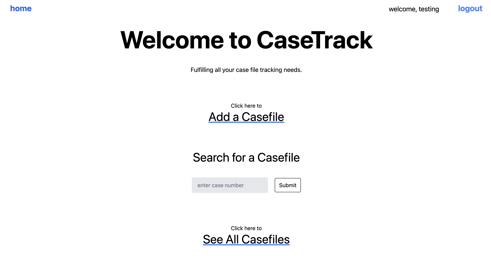
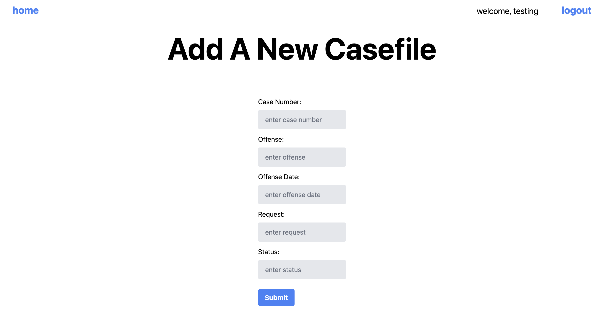

# CaseTrak---frontend

A laboratory information management system that fulfills all your case file tracking needs. Advance towards a paperless system where case information and evidence tracking is performed all on one platform. CaseTrak will improve efficiency and organization within your laboratory. Rely on this centralized hub where all case-related data is securely stored and easily accessible.

## Technologies Used:
- React  
- MongoDB  
- Mongoose  
- CORS  
- JWT/Bcyprt  
- dotenv  
- Tailwind CSS  
- Tailwind UI  

## Resources:
- Lecture Notes  
- Stack Overflow  
- ChatGpt  
- Tailwind CSS Documentation  
- Tailwind UI Documentation  

## Click to view CaseTrak:
- [Live View](https://casetrak-backend-c956cbec51a7.herokuapp.com 'Live View') 
- [Frontend Repo](https://github.com/bonnil1/CaseTrak---frontend 'CaseTrak Frontend')
- [Backend Repo](https://github.com/bonnil1/CaseTrak 'CaseTrak Backend')

## Trello Board:
- [Trello Board](https://trello.com/b/psv0MMmV/capstone 'Trello')

## Next Steps: 
- Add an upload PDF function for case notes + reports.
- Add a fifth model that includes testimony information.
- Finish full CRUD for evidence + investigator routes.
- Dropdown menus for forms that have set options. 